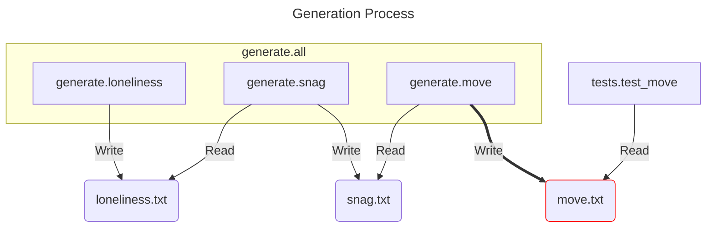

# Precompute

This project contains the generation system, tests, and utility code for the precomputation of tables used in the Tablut game engine.

## 📚 Index 

- 📌 [What It Does](#what-it-does)
- ⚙️ [How It Works](#how-it-works)
- 🚀 [How to Use](#how-to-use)

## What It Does

This module precomputes data structures that would be costly or redundant to compute at runtime, improving the performance of the engine.  
In particular, it generates values that speed up move generation, calculating all possible moves in advance.  
Normally, it needs to loop through every direction until it encounters a forbidden square or an enemy piece. 🐢  
Instead, the engine uses precomputed values for each piece, square, and piece configuration to quickly retrieve the move bitboard. ⚡

## How It Works



## How to Use

The following comands allow you to generate correcty the file `move.txt`, where you will find the precomputed keys and values.

```bash
python -m generate.all
python -m tests.test_move
```