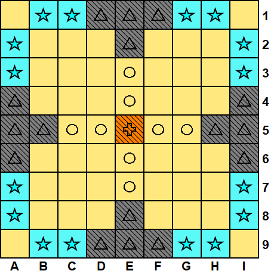
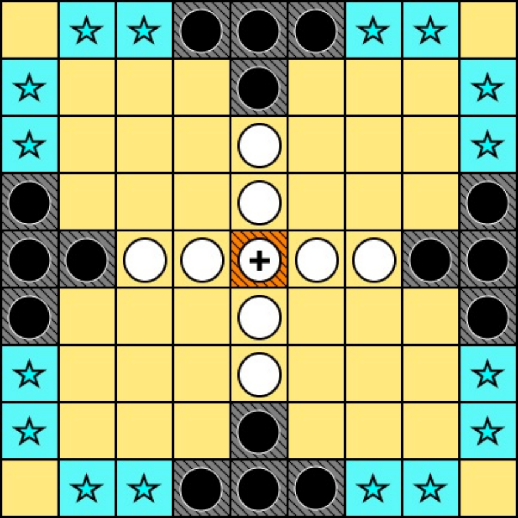

<h1 align="center">Tablut Rules</h1>

### Regole di Gioco di Tablut

Il gioco si svolge su una griglia 9×9 e coinvolge due giocatori, che si alternano compiendo un movimento per turno.
Le fazioni in gioco sono:

- Il **difensore** (bianco): controlla 8 pedine bianche  e 1 re .  
Il suo obiettivo è proteggere il re e guidarlo verso la fuga.

- L'**attaccante** (nero): dispone di 16 pedine nere .  
Il suo scopo è circondare il re, catturarlo e impedire la sua fuga dal castello.

La griglia presenta alcune **caselle speciali**, ognuna con una funzione ben definita:
- I **campi**  rappresentano le posizioni iniziali delle pedine nere.
Solo queste possono occuparli, e una volta usciti, non è più possibile rientrarvi.

- Il **castello**  è la posizione di partenza del re.
    Anche in questo caso, solo il re può sostarvi, ma non può farvi ritorno dopo averlo lasciato.

- Le **vie di fuga**  sono le caselle che garantiscono la vittoria al bianco:
    se il re riesce a raggiungerne una, la partita termina immediatamente.

**Movimenti** consentiti:
- Le pedine si muovono in direzione ortogonale (mai in diagonale), per un numero qualsiasi di caselle, senza mai poter scavalcare campi, castello o altre pedine.
- Le pedine nere possono muoversi liberamente all’interno del proprio campo di partenza, ma una volta uscite, non possono più farvi ritorno.
- Una volta che il re lascia il castello, non può più tornarvi e nemmeno attraversarlo.

Le pedine possono essere **catturate** secondo regole precise:
- Una pedina, bianca o nera, viene catturata quando si ritrova stretta tra due pedine avversarie su lati opposti.
- Il re se posizionato sul trono richiede una condizione particolare: può essere catturato solo se circondato su tutti e quattro i lati.
- Il re lontano dal trono: può essere catturato come se fosse una normale pedina (2 avversari su lati opposti)
- È possibile catturare più pedine contemporaneamente con un singolo movimento. Tuttavia, la cattura dev'essere attiva: se una pedina si posiziona volontariamente tra due avversarie, non viene catturata.

Esistono anche alcuni **casi speciali** di cattura:
- Una pedina, bianca o nera, può essere catturata anche quando si trova accanto a un campo o al castello (rispettivamente per bianchi e neri). Se una pedina avversaria si posiziona sulla casella opposta, la pedina viene comunque catturata: campi e castello agiscono come barriere fisse, indipendentemente dal fatto che siano occupati o meno.
- Quando il re si trova adiacente al castello, per catturarlo è sufficiente bloccare tutti i lati rimanenti con pedine nemiche.
- Quando il re si trova adiacente ad un campo (anche vuoto), basta porre un avversario sul lato opposto al campo e questo viene catturato

**Inizio** della partita: il bianco muove per primo.

La partita **termina** in uno dei seguenti casi:
- Il re raggiunge una via di fuga, in questo caso <ins>vince il bianco</ins>;
- Il re viene catturato, in questo caso <ins>vince il nero</ins>;
- Un giocatore non può più muovere pedine, in questo caso tale giocatore perde;
- Lo stato di gioco si ripete due volte, in questo caso si ha un pareggio.

